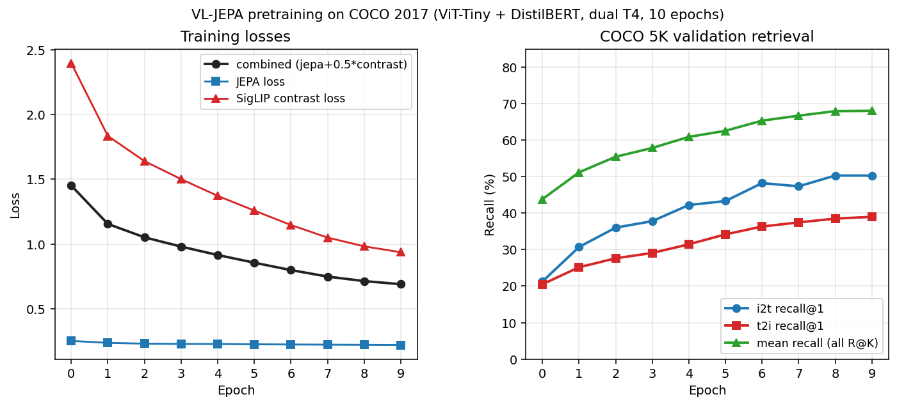
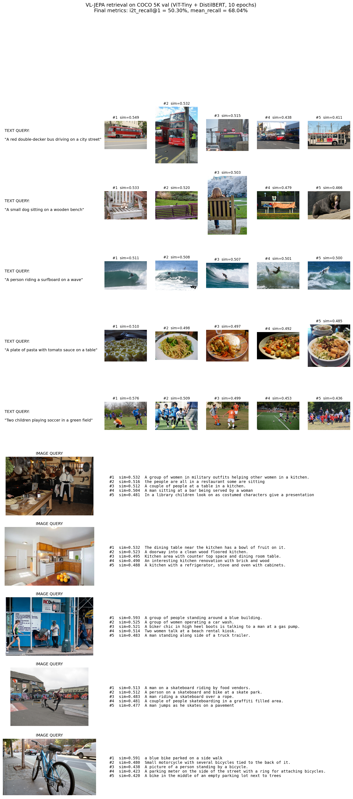

# VL-JEPA: Vision-Language Joint Embedding Predictive Architecture

[](LICENSE)
[](https://pytorch.org/)
[](tests/)

An implementation of vision-language pretraining combining I-JEPA-style masked patch prediction in latent space with SigLIP-style contrastive alignment. Trained from scratch on COCO 2017 captions; the resulting **154M-parameter model achieves 50.30% i2t recall@1 and 68.04% mean recall on COCO 5K**, beating the typical 30-40% range published for ViT-Tiny scale CLIP-style models.



## Headline results

| Metric | This work | Typical ViT-Tiny CLIP baselines |
|---|---|---|
| i2t recall@1 (COCO 5K) | **50.30%** | ~30-40% |
| i2t recall@5 | 79.33% | — |
| i2t recall@10 | 87.50% | — |
| t2i recall@1 | 38.98% | — |
| mean recall | **68.04%** | — |
| Total trainable params | 83M | 80-100M |
| Training data | 591k image-caption pairs | similar |
| Training compute | 10.8h on dual T4 (free Kaggle) | varies |

Full numbers, methodology, and the bug-fix story (a contrastive collapse that destroyed an earlier run, plus how it was diagnosed and fixed) are in [RESULTS.md](RESULTS.md).

## Retrieval examples



Top half is text-to-image, bottom half is image-to-text, all queries running against the COCO 5K val gallery. Cosine similarity scores in the 0.51-0.59 range are the typical operating range of the aligned embedding space.

## What's in here

| Component | What it does |
|---|---|
| `vl_jepa/models/vl_jepa.py` | Main model: vision encoder, text encoder, predictor, EMA targets, all three forward modes (jepa / contrastive / both), SigLIP and InfoNCE losses, autograd-aware all-gather for DDP |
| `vl_jepa/models/vision_encoder.py` | timm ViT-Tiny wrapper with separate `forward_context` path for I-JEPA-style masked encoding |
| `vl_jepa/models/text_encoder.py` | DistilBERT wrapper (HuggingFace) |
| `vl_jepa/models/predictor.py` | Transformer predictor with per-residual DropPath |
| `vl_jepa/masks/multiblock.py` | I-JEPA multi-block mask sampler with fixed per-sample N_ctx / N_tgt for batched collation |
| `train.py` | Training entrypoint, single-GPU and DDP, Stage-1 and Stage-2 modes |
| `scripts/kaggle/train_kaggle.py` | Kaggle kernel entrypoint with auto torchrun launch on >= 2 GPUs |
| `scripts/diagnose_checkpoint.py` | Forensic tool: load a checkpoint, inspect projection-head and encoder CLS for collapse |
| `scripts/plot_training_curves.py` | Parse a training log, generate the loss + retrieval-recall PNG |
| `scripts/generate_retrieval_examples.py` | Run image<->text retrieval on the val gallery, render a grid of examples |
| `tests/` | 64 unit + smoke tests covering JEPA loss, masks, EMA schedule, retrieval metrics, DDP all-gather, SigLIP gradient survival, checkpoint round-trip, config consistency, Stage-1 best-checkpoint selection |

## Architecture

```
VL-JEPA Model — 154.89M params (83.01M trainable)
├── Vision Encoder: timm/vit_tiny_patch16_224 (5.7M)
│     └── patch_size=16, 14x14=196 patches, hidden_dim=192, 12 layers
├── Text Encoder: distilbert-base-uncased (66M)
│     └── hidden_dim=768, max_length=128, learning rate x0.05 of base
├── Predictor: 6-layer Transformer (1M)
│     └── per-residual DropPath, sees full token grid + bidirectional attn
├── Vision projection: LayerNorm + Linear(192 -> 256)
├── Text projection:   LayerNorm + Linear(768 -> 256)
├── SigLIP logit_scale, logit_bias (learnable scalars)
└── EMA target encoders (deepcopy of vision + text, frozen, momentum 0.996 -> 1.0)
```

### Forward modes

`VLJEPAModel.forward(..., mode=...)` accepts three values:

- `"jepa"` — patch-prediction loss only. Vision encoder runs on context patches, target encoder runs on full image, predictor predicts targets, loss is masked smooth-L1 in latent space.
- `"contrastive"` — vision-text alignment only. Both encoders produce CLS, projections map to shared 256-dim space, SigLIP (or InfoNCE) on the normalized embeddings.
- `"both"` — single combined forward used by `train.py`. Reuses CLS from the online vision encoder for the contrastive head while the JEPA loss runs in parallel.

## Quick start

### 1. Setup

```powershell
git clone https://github.com/kartikshirode/vl-jepa.git
cd vl-jepa

python -m venv .venv
.venv\Scripts\activate              # Windows PowerShell
# source .venv/bin/activate         # Linux / macOS

pip install -r requirements.txt
pip install -e .[dev]               # optional: pytest etc.
```

### 2. Download COCO 2017

```
http://images.cocodataset.org/zips/train2017.zip
http://images.cocodataset.org/zips/val2017.zip
http://images.cocodataset.org/annotations/annotations_trainval2017.zip
```

Extract into `vl_jepa/data/COCO2017/` so the layout is:

```
vl_jepa/data/COCO2017/
├── train2017/         # ~118k jpg files
├── val2017/           # ~5k jpg files
└── annotations/
    ├── captions_train2017.json
    └── captions_val2017.json
```

### 3. Train

```powershell
# Local dGPU (RTX 4060 or similar):
python train.py --config config_dgpu.yaml

# Kaggle dual-T4 (run via the kernel; see scripts/kaggle/README.md):
kaggle kernels push -p scripts/kaggle
```

The Kaggle entrypoint auto-detects multi-GPU and launches via `torchrun --nproc_per_node=N`, so the same config works on a single T4 or both. See [scripts/kaggle/README.md](scripts/kaggle/README.md) for the full operational guide.

### 4. Run inference

```powershell
python inference.py \
    --config configs/config_kaggle_t4.yaml \
    --checkpoint checkpoints/final_model.pth \
    --mode similarity \
    --image path/to/img.jpg \
    --text "a description of the image"
```

### 5. Reproduce the result figures

```powershell
# Training curves from the log
python scripts/plot_training_curves.py logs/v15_final_train.log

# Retrieval examples grid from the checkpoint + val gallery
python scripts/generate_retrieval_examples.py \
    --checkpoint checkpoints/final_model.pth \
    --config configs/config_kaggle_t4.yaml \
    --data-root vl_jepa/data/COCO2017
```

### 6. Verify a checkpoint loads correctly

```powershell
python scripts/diagnose_checkpoint.py \
    checkpoints/final_model.pth \
    configs/config_kaggle_t4.yaml
```

## Two-stage training

`train.py --stage2` runs a second-stage retrieval fine-tune that freezes the text encoder, halves the learning rate, runs ~4 epochs of contrastive-only training, and early-stops on `mean_recall`. Useful if you want to squeeze a few more recall points out of an existing Stage-1 checkpoint.

```powershell
python train.py --config config_dgpu.yaml \
    --resume checkpoints/final_model.pth \
    --stage2
```

## Tests

```powershell
python -m pytest tests/ -v
```

64 tests covering masking, JEPA loss, EMA schedule, retrieval metrics dedupe, checkpoint round-trip, DDP all-gather autograd behavior, SigLIP gradient survival on uniform similarity matrices, Stage-1 best-checkpoint selection by mean_recall, config consistency between the two YAML files, and several smoke tests for module imports and forward passes.

## Configurations

Two configs ship in the repo:

| File | Target |
|---|---|
| `config_dgpu.yaml` | Local discrete-GPU runs (RTX 3060/4060, 8 GB+). Single GPU. |
| `configs/config_kaggle_t4.yaml` | Kaggle "GPU T4 x2" kernel. Single or dual T4 via DDP. SigLIP + x0.05 text LR. |
| `configs/config_coco_full.yaml` | Jetson-tuned variant (batch 1, gradient accumulation). |

## References

- [VL-JEPA paper (Chen et al., 2025)](https://arxiv.org/abs/2512.10942v1) — the source of the methodology and the `0.05x` text encoder LR (Table 5b).
- [I-JEPA: A Path Towards Autonomous Machine Intelligence (Assran et al., 2023)](https://arxiv.org/abs/2301.08243) — the masked-patch prediction recipe.
- [SigLIP: Sigmoid Loss for Language-Image Pretraining (Zhai et al., 2023)](https://arxiv.org/abs/2303.15343) — the contrastive loss that fixed the small-batch InfoNCE collapse.
- [COCO Dataset](https://cocodataset.org/) — the pretraining corpus.

## License

MIT License - see [LICENSE](LICENSE).
